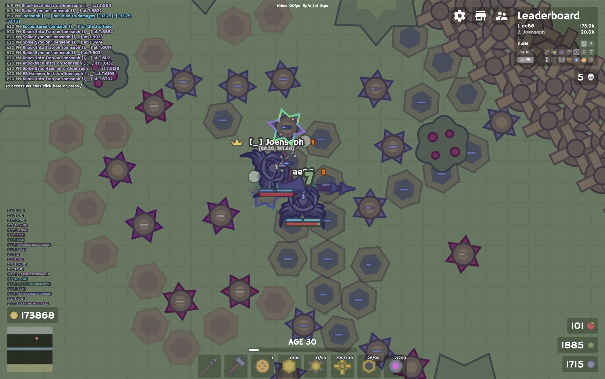

# tailwind: userscript for moomoo.io

this is the tailwind userscript in two forms: the built bundle and the un-bundled source. every webpack module pulled back out into its own file so it can actually be read

`tailwind.js` at the root is the single-file bundle, the thing that actually runs. the `src/` tree is read-only - the files still reference each other through webpack's `__webpack_require__(...)`, so nothing there runs on its own; it just mirrors the bundle so the code can be read

> `src/js/app.js` is where all the tailwind code lives, and it carries in-depth jsdoc comments on every tailwind class, method, and helper - so that is the place to start if you want to understand a feature

the repo also holds `server.js`, the little relay that backs tailwind's cross-client features

> this is pinned to one game version - it only works on moomoo.io v1.8.2 and its native bundle `index-8f264913.js`. if moomoo ships a game update or a new bundle hash, the hooks stop lining up unless tailwind is rebuilt against it

## demo

## layout

- `tailwind.js` - the single-file bundle, the thing that actually runs
- `src/js/app.js` - entry point, the whole mod and game client live here
- `src/js/config.js` - game constants
- `src/js/data/` - game data and managers (player, items, objectManager, store, ai, projectiles)
- `src/js/libs/` - helpers: utils, io-client, animText, modernizr, and page (main menu and game ui)
- `vendor/` - third-party libs (base64-js, buffer, msgpack-lite, ieee754, int64-buffer, event-lite, process, webpack)
- `vultr/VultrClient.js` - server list and region picker
- `loader.js` - "loader" userscript, deletes the native bundle and loads tailwind
- `server.js` - the websocket relay (see below)
- `docs/` - deep-dive writeups on individual mechanics

## game basics

moomoo.io runs on a fixed server tick, and almost all of tailwind's combat math is written in ticks, not seconds

> a tick is ~111ms - the server updates 9 times a second, so `config.tick` just counts ticks and everything timed (reloads, one-tick windows, melee sync arrival) is measured against it

these are all part of the game itself, and show up all over the code:

- `sid` - a player's server id, the unique number the server hands each player. tailwind keys almost everything off it - per-player colors, looking a player up (`findPlayerBySID`), pairing sync partners over the relay
- player update order is by gold - the server steps players in `leaderboard` order, richest first, so of two players next to each other the one with more gold gets its new position this tick while the other is still a tick behind
- `reloads` - every player has three reload timers (primary, secondary, turret) that tick up each update, most combos only fire once the ones they need are ready
- `buildIndex` - below 0 means the player is holding a weapon, 0 or higher means a build item is out, and weapon reloads only advance while a weapon is held
- ids - weapons, hats, accessories, and buildables are referenced by number, not name - `items.weapons[5]` is the polearm and `items.weapons[10]` the great hammer, `store.hatById[7]` the bull helmet and `store.hatById[53]` the turret gear, so the combat code reads as a lot of bare numbers
- bull-tick and poison - the bull helmet's self-drain and poison damage land on a fixed cadence, once every 9 ticks (~1s). tailwind tracks each player's bull-tick timing (`isBullTickTime`) so bleed and poison combos land their swing on the same tick the extra damage ticks
- shame - the game punishes panic-healing. eat within ~120ms of taking a hit and you gain a shame count (`shameCount`), 8 of them locks healing for 30 seconds and drops the shame hat on you. auto-heal deliberately waits that window out, and tailwind tracks enemies' shame too
- input rate - the base client only pushes your aim about 5 times a second (`clientSendRate`) while the game ticks 9 times a second, so tailwind sends its own aim and attack packets directly when a combo needs exact timing
- world units - the map is 14400 x 14400 (`config.mapScale`) and a player is 35 units across (`config.playerScale`), everything positional is in these raw units

> gold order matters most to the one-tick code, which aims at the enemy's predicted step based on who "updates first" - the weapon-reach checks that gate a swing (melee sync's arm and fire checks included) lean on it too through `nearVelocity`, just more subtly

## how it hooks the game

tailwind never has server authority, it just reacts; it reads the same websocket packets the normal client gets, runs its own read of the board each tick (threat scan, then the action pipeline), and sends the same inputs a human would - move, aim, attack, place, buy. the `loader.js` userscript swaps the native game bundle for `tailwind.js` so all of this loads in place of the real client

> !!dynamic one-tick, two hits on one server tick gets its own in-depth explanation and a demo video in [docs/one-tick.md](docs/one-tick.md)

## relay (server.js)

a small node websocket server that links tailwind users to each other. it only forwards messages between connected clients, no game state of its own. it backs the features that need players to talk across the game:

- private chat between tailwind users
- shared enemy radar - allies broadcast enemy positions
- sync coordination - the "sync" toggle state text and melee-sync firing
- presence and a rough clock sync for timing

run it locally with `npm start` (that is `node server.js`, needs node 18+ and the `ws` dep); the live copy runs on render, deployed from this repo

## notes

- `tailwind.js` is the real bundle, edits go there first, then get mirrored back into the `src/` files
- the `src/` copy carries jsdoc comments that walk through what each tailwind feature does and how it works, the bundle (`tailwind.js`) doesn't have them
- `node_modules` is only needed to run the relay and is regenerable with `npm install`, so it stays out of git
