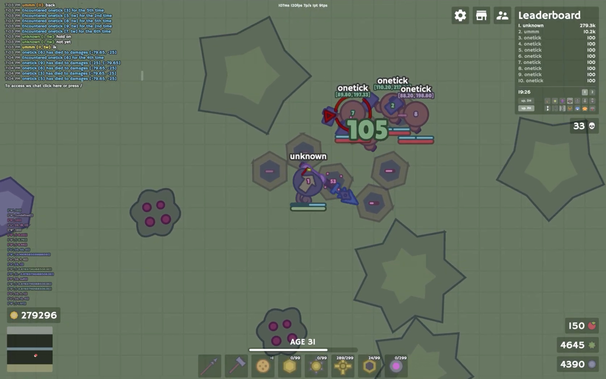

# one-tick: two hits on one server tick

a one-tick lands two hits - a turret ball and a polearm swing - on the **same** server tick, so the enemy eats the whole burst in a single update, before they ever get to heal. doing that by hand is basically impossible - it's all timing the client solves for you

**why it's hard** - the server updates 9 times a second (~111ms a tick), so "same tick" is a real window you either hit or miss. the ball has travel time, the polearm has reach and reload, and the annoying part: you and the enemy don't update at the same instant. the server steps players in gold order (richest first), so the two of you are effectively a tick out of sync with each other. get any of it wrong and the two hits land on different ticks and do nothing together

**predicting enemy position** - every tick, `dOTProjectEnemy` rolls the target 5 ticks into the future along its current move dir, using the same physics predictor the movement code uses (it locks accel-vs-decel on the first step so the path matches whether they're speeding up or slowing down). that gives predicted positions `proj[0..4]`. then gold order decides *which* step to aim at: `updatesFirst(player, enemy)` (the `leaderboard` check) gives `moreGold` - if we update first we aim the follow-up swing at `proj[0]` (where they are now), if they update first we aim at `proj[1]` (a tick ahead, since they'll have moved before our hit resolves). all of this is only as sharp as the physics under it - `velocity.predict` reproduces the game's own movement (acceleration, the speed cap, how a player coasts to a stop) tick for tick, so the predicted spots line up with where the server will actually put everyone. drift there and the window and fan math would all be aiming at the wrong place

**distance window** - the turret ball flies at a fixed speed, so its flight time - and which tick it *arrives* on - depends only on how far the enemy is when you fire. `dOTFireCheck` requires the ball to sit in a distance band, `winLo` (175) to `winHi` (298) units, minus 35 for the enemy's radius. that band is exactly the set of distances where the ball's arrival tick lines up with the follow-up swing - too close it arrives a tick early, too far a tick late, in the window they land together

> the whole trick is that distance window - it's just the set of ranges where the ball's flight time drops it on the same tick your polearm swing lands. the fan and the prediction are all machinery to get you standing in that band at the right moment

**fire fan** - where you're *standing* when you fire changes both the ball distance and whether the swing can reach, so the client doesn't just fire from where you are, it searches. `dOTPlan` sweeps a fan of `fireFan` (72) move directions evenly spaced around the circle, plus a "coast" option (don't move). for each it simulates stepping you one tick that way, then scores the spot with `dOTFireCheck`:

- does the enemy ball land in the [175, 298] window from there?
- does the follow-up polearm swing (simulated under the bull hat) reach the enemy's predicted swing spot with at least `reachMargin` (5) units of slack?
- is the path clear - no wall between you and the fire spot, or the fire spot and the ball?

each valid candidate gets a score (more centered in the window + more reach slack = better), and it moves you in the best direction, then fires. 72 steps is enough angular resolution to thread the window to sub-pixel precision - it's tuned; too low and it can't hit the spot, too high is wasted work

**staging** - the combo plays out over two ticks:

- **tick 1, fire** - once the turret's been reloaded and *settled* for `turretSettle` (2) ticks (so it's genuinely ready), and a fan direction scores a valid plan, it equips the turret gear (hat `53`), fires the ball, and sets `moveTo` to the winning fan direction so you step into the exact firing spot. then it latches `stage = 1`.
- **tick 2, swing** - the next tick swaps to the bull hat (`7`), aims, and swings the polearm. the ball, fired a tick earlier and mid-flight, arrives this same tick - so both hits register together

**fire latch** - to stop it firing at bad moments or spamming, `#canFire` is a hysteresis latch tied to the fireable ring (`dOTRing`): it arms when you're past the ring's outer edge, disarms once you're inside the inner edge, with small pads and a `latchFreeze` (2-tick) freeze after each fire so it can't flip-flop

**tuning** - the whole thing hinges on the gold-order guess, and for players who aren't on the leaderboard there's no rank to read it from, so after each fire a watcher tracks how much damage *actually* landed over the next few ticks. if the combo connected, the assumed order was right; if it whiffed, it was wrong. it writes that back per-enemy (`dOTMeFirst`) so the next attempt against that player aims at the correct predicted step. it only learns from the ambiguous no-leaderboard case, since the leaderboard already answers it directly

> there's also a crossbow variant: the repeater crossbow fires on the same tick the turret gear equips, but we can't land the arrow on the same tick so it's more like an advanced 2-shot combo
